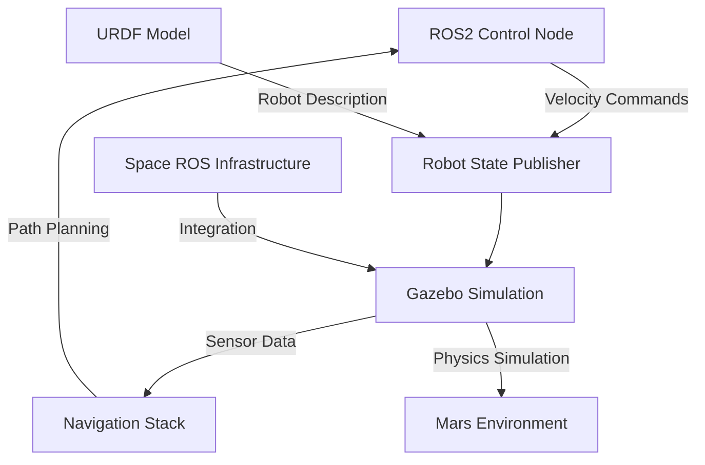
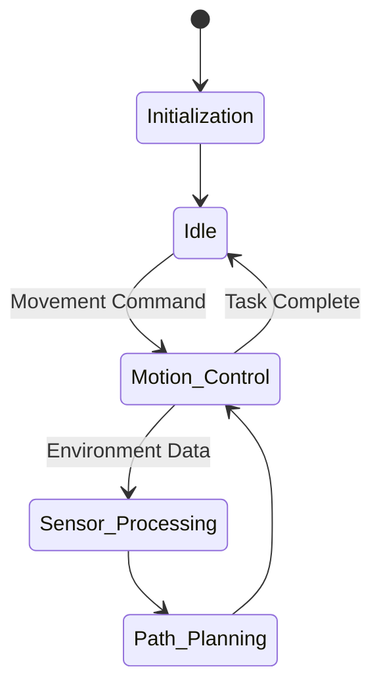

# NASA Space ROS Simulation Project 2024


## 🚀 Project Overview
This project is part of the NASA Space ROS Simulation Summer Sprint Challenge (July 2024 - August 2024). Our team developed advanced simulation capabilities for Mars rover operations using ROS 2 and Gazebo frameworks, contributing to NASA's Space ROS infrastructure for future space exploration missions.

## 👥 Team Members
### Team Lead
- **Md Khairul Islam**
  - Institution: Hobart and William Smith Colleges, Geneva, NY
  - Major: Robotics and Computer Science
  - Contact: khairul.islam@hws.edu

### Contributors
- Wasif Karim
- Kawsar Khan
- Shojib Bhuiyan
- Kevin Zou

## 🏗️ System Architecture



## 🛠️ Technical Components

### 1. Rover Control System


The rover control system consists of:
- Motion control node for velocity commands
- Sensor data processing
- Path planning and navigation
- Integration with Space ROS infrastructure

### 2. Simulation Environment
The project utilizes Gazebo for physics-based simulation, featuring:
- High-fidelity Mars terrain modeling
- Accurate physics simulation
- Sensor simulation (cameras, IMU, etc.)
- Real-time visualization

### 3. URDF Model
The rover's physical model includes:
- Chassis with precise mass and inertia properties
- Articulated wheel system
- Sensor mounts
- Collision detection setup

## 🚀 Getting Started

### Prerequisites
```bash
# Install ROS 2 
sudo apt install ros-humble-desktop-full

# Install Gazebo
sudo apt install gazebo

# Install additional dependencies
sudo apt install ros-humble-gazebo-ros-pkgs
```

### Installation
```bash
# Create a workspace
mkdir -p ~/rover_ws/src
cd ~/rover_ws/src

# Clone the repository
git clone https://github.com/your-username/nasa-ros-2024.git

# Build the workspace
cd ~/rover_ws
colcon build
```

### Running the Simulation
```bash
# Source the workspace
source ~/rover_ws/install/setup.bash

# Launch the simulation
ros2 launch rover_simulation rover_launch.py
```

## 📁 Project Structure
```
nasa-ros-2024/
├── config/
│   └── rover_params.yaml
├── launch/
│   └── rover_launch.py
├── src/
│   ├── control_node.py
│   └── navigation/
├── models/
│   └── rover_urdf.xml
└── worlds/
    └── mars_terrain.world
```

## 🎮 Control Interface
The rover can be controlled through:
1. Command-line interface using ROS 2 topics
2. Custom GUI interface
3. Autonomous navigation system

### Basic Control Commands
```bash
# Move forward
ros2 topic pub /cmd_vel geometry_msgs/msg/Twist "linear:
  x: 0.5
  y: 0.0
  z: 0.0
angular:
  x: 0.0
  y: 0.0
  z: 0.0"
```

## 🔍 Key Features
- Real-time simulation of Mars rover operations
- Advanced path planning and obstacle avoidance
- Integration with NASA's Space ROS infrastructure
- High-fidelity sensor simulation
- Custom terrain generation
- Telemetry and data logging

## 🤝 Contributing
1. Fork the repository
2. Create your feature branch (`git checkout -b feature/AmazingFeature`)
3. Commit your changes (`git commit -m 'Add some AmazingFeature'`)
4. Push to the branch (`git push origin feature/AmazingFeature`)
5. Open a Pull Request

## 📜 License
This project is licensed under the MIT License - see the [LICENSE.md](LICENSE.md) file for details.

## 🙏 Acknowledgments
- NASA Tournament Lab
- Space ROS Development Team
- Hobart and William Smith Colleges
- All contributing team members

## 📞 Contact
For any queries regarding the project, please contact:
- Md Khairul Islam - khairul.islam@hws.edu

## 📚 Additional Resources
- [ROS 2 Documentation](https://docs.ros.org/en/humble/)
- [Space ROS Documentation](https://nasa.github.io/space-ros/)
- [Gazebo Tutorials](http://gazebosim.org/tutorials)
